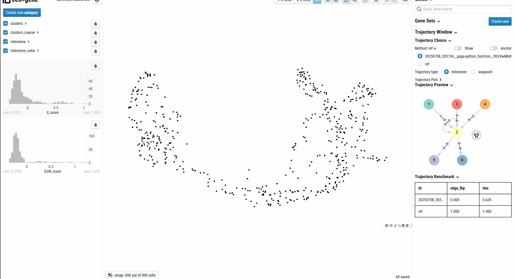

# cellxgene-cafe

本文档旨在帮助开发者快速理解 `cellxgene-cafe` 项目，并在此基础上进行二次开发。`cellxgene-cafe` 是 `cellxgene` 的一个分支，它集成了 `cafe-release` 框架的功能，以支持单细胞轨迹的可视化和分析。

## 1. 当前工作

### 1.1 启动 cellxgene-cafe

1. cellxgene环境安装
   ```bash
   # download github repository 
   git clone https://github.com/HuangDDU/cellxgene.git
   git check dev # cellxgene=cafe is available on dev branch
    cd cellxgene

   # development environment  
   make dev-env
   ```

2. 启动服务
    ```bash
    # start backend on port 5000, refer to config file "common.mk", including data path ...
    make start-server

    # start frontend on port 3000
    cd client/
    make start-frontend
    ```

3. 访问：http://localhost:3000 。


### 1.2 功能说明

`cellxgene-cafe` 在原生 `cellxgene` 的基础上，增加了以下与轨迹分析相关的功能：
1.  **轨迹展示**: 在 UMAP 等降维视图上，能够根据 cafe 计算的降维轨迹（trajectory embeddingembedding）结果，展示细胞分化轨迹。
2.  **样式调整**: 提供了对轨迹线条、边缘和里程碑（milestone）节点样式的动态调整功能，方便用户进行个性化探索。
3.  **网络预览**: 基于 `cytoscape-js`，实现了里程碑网络（milestone network）的预览功能，帮助用户理解轨迹的拓扑结构。

### 1.3 开发流程
> 1. `cafe-cellxgene` 的开发涉及前端和后端的修改。
> 2. 多使用Git Graph工具，及时保存提交代码。查看当前dev分支相对于main分支的改进来学习现有代码的变化
> - 使用Git Graph的比较功能，所有文件直接排列，效果不是很清晰
> - 在main上创建临时main_tmp分支，把dev合并上去看看哪些文件发生了变化，以及我加入的一些注释。
> 

#### 1.3.1 项目结构

只关注的文件
- **client**: 前端项目
- dev_docs: 开发文档
- docs：文档图片
- **server**：后端项目
- common.mk: make相关命令
- **environment.xxx.json**：数据配置文件

#### 1.3.2 后端开发（./server）
1. URL定义：`app/app.py`中UnsAPI类定义返回url, `common/rest.py`中uns_get函数定义返回格式为JSON。
2. 数据提取：`anndata_adaptor/anndata_adaptor.py`实现`data_common/data_adaptor`中定义的接口，即返回uns中数据。
3. 后端开发时，需要退出后清理端口（fuser -k 5005/tcp）重启。


#### 1.3.3 前端开发（`./client`）

1. 文件结构（核心源代码文件：`./client/src`）：
   - actions: redux的action。
   - annoMatrix: 相当于后端的AnnData，可以与后端异步处理。
   - components: 页面组件，可以使用浏览器中的React插件分析。
   - font: 字体文件。
   - images: 公共图片。
   - reducers: redux的reducer。
   - util: 工具函数。
   - gobal.js: 全局变量定义影响页面样式，包括主题色。
   - index.js：全局页面 Provider。
   - index.css: 全局的blueprint css、字体说明。
  
2. 功能实现
   -  数据存储：页面初始化时（`actions/index.js`中doInitialDataLoad函数），cafe的轨迹数据存储在annoMatrix.uns（`annoMatrix/annoMatrix.js`），由AnnoMatrixLoader（`annoMatrix/loader.js`）直接从后端API(trajectory/obs)请求所得，并且都从JSON转化为danfo结构的DataFrame。
   -  轨迹展示：在整体页面的（`component/app.js`）的Graph组件图层堆叠（`component/graph/overlays`）轨迹及标签。
   -  轨迹样式控制：
      -  控制面板：在右侧面板（`component/rightSidebar/index.js`）添加轨迹控制面板（`component/trajectoryWindow`）。
      -  轨迹选择：由一堆轨迹方法、样式相关按钮（`component/trajectoryWindow/choice.js`）出发对应的action。
      -  预览面板（`component/trajectoryWindow/preview.js`）：使用`cytoscape-js`实现里程碑网络可视化。
      -  benchmark面板（`component/trajectoryWindow/benchmark.js`）：表格展示，暂时只展示两个指标。

3. 前端开发时，可以运行开发服务器以实现热重载（Hot-Reloading），保存之后就可以实时看到前端结果，提高开发效率：

## 2. 后续规划
## 2.1 模块化插件
不再侵入式窗口，而是像cellxgene_vip一样插件式的轨迹展示，可以随着cellxgene的版本升级而适配。参考[cellxgene_vip](http://github.com/interactivereport/cellxgene_VIP)。

## 2.2 启动方式调整
1. **命令行运行**：打包好后直接启动，`cellxgene-cafe launch <path/to/h5ad> `
2. **Python代码启动**：FateAnnData热启动：`fadata.launch_cellxgene_cafe()`

## 2.2 功能添加——Cafe平台化
1. **可视化丰富**：对应cafe.plot.plot_xxx函数，可以绘制伪时间、伪速率、饼状网络图等（直接图片返回/前端样式调整）。
2. **方法调用**：可以调用计算，scVelo, CellRank等，参数选择填写。
3. **Cafe平台化**: 可以传入普通AnnData的h5ad数据，完成对于预处理、方法调用等。
4. Benchmark优化：表格样式美化。

## 2.3 数据平台
构建用于展示多个轨迹金标准的数据平台，参考[cellxgene_gateway](https://github.com/Novartis/cellxgene-gateway)。
